# How computers work

- [How computers work](#how-computers-work)
  - [Data Manipulation](#data-manipulation)
    - [Basic CPU components](#basic-cpu-components)
    - [Machine language](#machine-language)
    - [Program Execution](#program-execution)
    - [Arithmetic/Logic Operations](#arithmeticlogic-operations)
    - [Rotation and shift](#rotation-and-shift)
    - [Communicating with other devices](#communicating-with-other-devices)
  - [Operating Systems](#operating-systems)
    - [Operating System Architecture](#operating-system-architecture)
    - [The concept of a Process](#the-concept-of-a-process)
    - [Handling competing processes](#handling-competing-processes)
  - [Databases](#databases)
    - [The relational model](#the-relational-model)

The electronic circuits on computers tasked with manipulating data are called CPUs (Central Processing Units). They used
to be large multi-rack machines but now they are small and compact units called motherboards or microprocessors.

## Data Manipulation

### Basic CPU components

A CPU contains three main components:

- The arithmetic unit (circuits that do operations on data)
- The register unit (contains data storage units called registers)
- The control unit (circuits that coordinate the machine's activities)

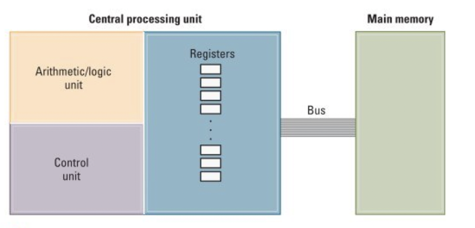

Register comes in two flavours, general and special purpose registers. General purpose registers act as temporary holding
places for data being manipulated by the arithmetic unit. To perform operations on data stored in main memory
the control unit will transfer data from main memory into the registers and makes them available to the arithmetic unit.

Data is transfered to and from main memory through the **bus**, a set of wires that connect the CPU to main memory. It reads
by supplying main memory with the address of the data that it requires and writes by supplying the memory address to which
it should be written.

The idea of the stored prorgam concept is the idea that a computer's CPU doesn't have to be rewired to execute a different
program but instead you could store the instructions as data in memory, to be retrieved and executed as needed.

It is useful to think of diffent types of memory in terms of when the data that is contained within them is going to be
used:

- Registers for data immediatly needed by the program
- Cache memory also within the CPU
- Main memory for data needed in the near future
- Mass storage for data at rest

Cache memory is used as an additional high speed of access memory directly within the CPU. The machine keeps a copy of main
memory that is of interest there and thus avoids doing the longer back and forth trips between CPU and memory when that
data is already avaible within the CPU.

### Machine language

To apply the stored program concept CPUs are designed to recognise instruction in the form of bit patterns called machine
language.

There are two philosophies:

- RISC (Reduced Instructions Set Computer) in which a CPU should operate with a minimal set of instructions that it can
  compose into more complex ones
- CISC (Complex Instructions Set Computer), the opposite of RISC. Computer should be able to handle the ever more complex
  set of instructions and demands

Machine instructions (a.k.a : op-codes) can be grouped into a few buckets:

- Data transfer instruction
  - Technically a misnomer because data is not moved from main memory but copied into the CPU.
  - Copying from a memory cell to a register is called **LOAD** and the reverse is called **STORE**
- Arithmetic/Logic
  - Performs operations on one or more pieces of data within registers
  - Basic arithmic operation such as ADD, SUBTRACT as well as boolean operation such **OR**, **AND**, **XOR**
  - Other types of arithmetic operations are for moving the content of register left and right such as **ROTATE** or **SHIFT**
- Control
  - Direct the execution of programs rather than manipulating data such as **JUMP** or **BRANCH**

Instructions are of fixed length in RISC and variable in CISC. The op-code lets the machine know the length of the incoming
instruction. The program counter keeps track of which operation to execute next and increments accoringly.

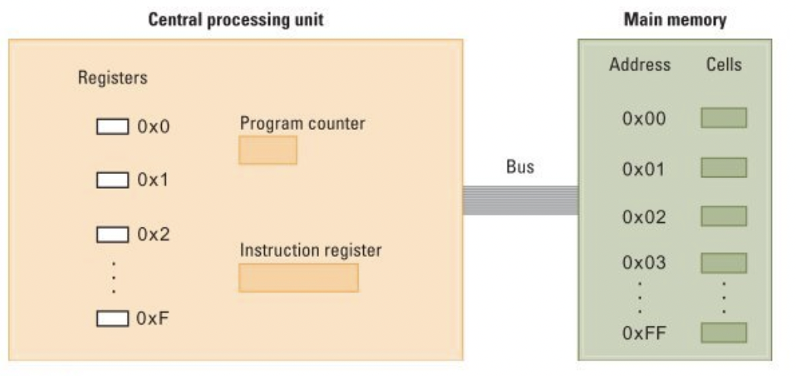

The machine instructions are split into two pieces, the op-code and the operand

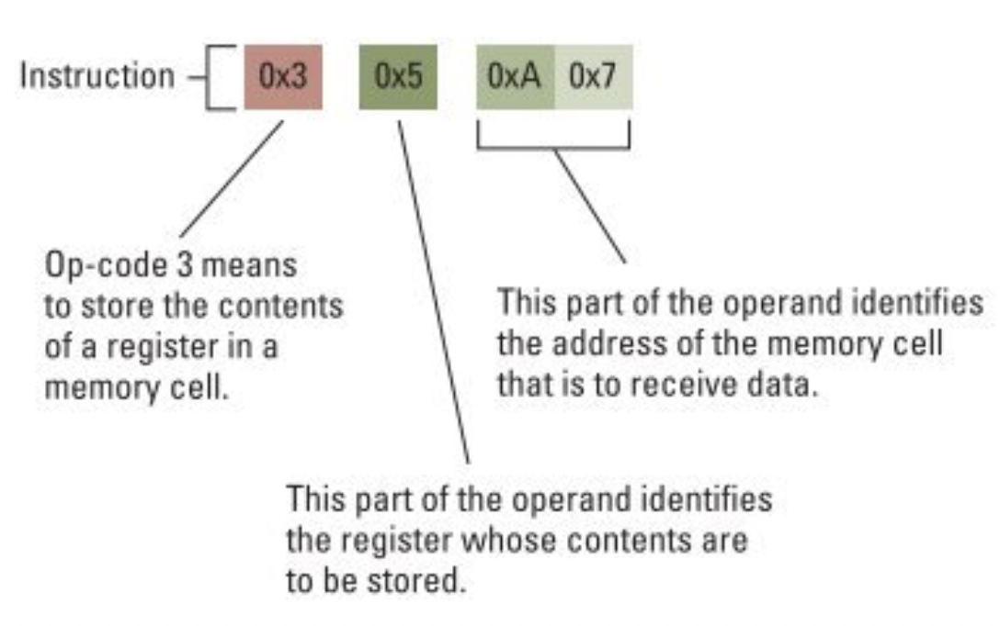

### Program Execution

A CPU copies instructions from main memory and executes them in order unless the order is altered by a **JUMP** instruction.

Two components of CPU take care of the order in which the instructions are executed:

- The instruction register: holds the instruction currently being executed
- The program counter: holds the address of the next intruction to be executed

The CPU goes through a three step process called the machine cycle:

- fetch: request the instruction stored at the address shown by the program counter and increment it.
- decode: breakup the bit pattern into op-code and operand
- execute: activate the appropriate circuits

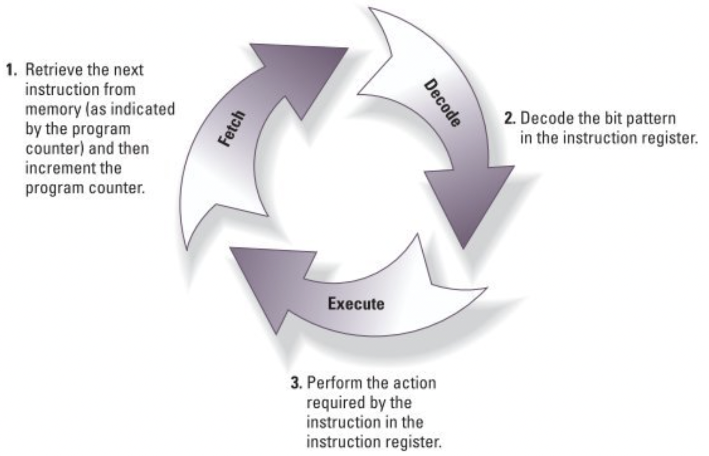

### Arithmetic/Logic Operations

AND operations, used to add 0s to one part of the pattern without disturbing the rest (also called masking).

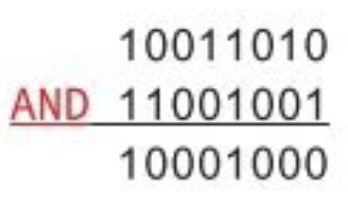

OR operations:

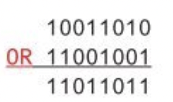

XOR operations:

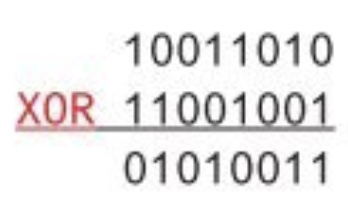

### Rotation and shift

Used to move bits within register, often for solving aligntment issues.

Moving all bits to the right and replacing the bit at the left with the one the "fell off" on the right is called **circular
shift**.

Discarding the bit that "fell-off" and replacing it with 0 is called **logical shift**. Shifting two's complement bit pattern
to the left/right corresponds to a division/multiplication by ten. Care must be taken to realize that the rightmost bit
is sometimes the sign bit denoting negative/positive. **Arthmetic shift** always fill that bit with its original value.

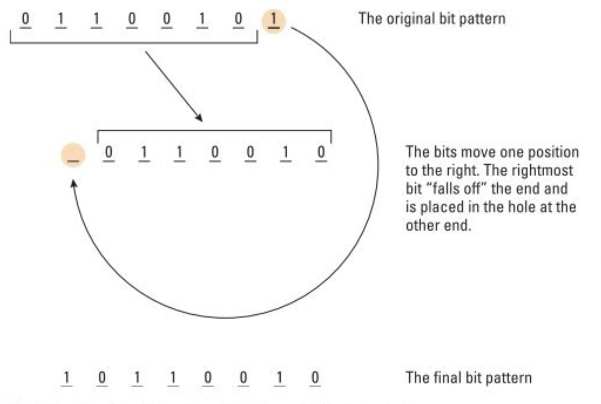

### Communicating with other devices

Communication with other devices such as keyboards, mouses, speakers etc is done via controllers. They are circuits either
built into the motherboards or expansion boards that plug into them.

Controllers previously were designed specifically for the devices in question but with the increasing number of devices,
standards arose. Popular examples of controllers are the USB (Universal Serial Bus) and HDMI (High Definition Multimedia
Interface).

Each controller communicates with the computer using the same bus that connects CPU and main memory. In some cases, controllers
are designed to respond to referenes to specific memory addresses which the main memory ignores. This is called **memory-mapped
I/O**, bit patterns are read/written from/to controllers rather than on main memory.

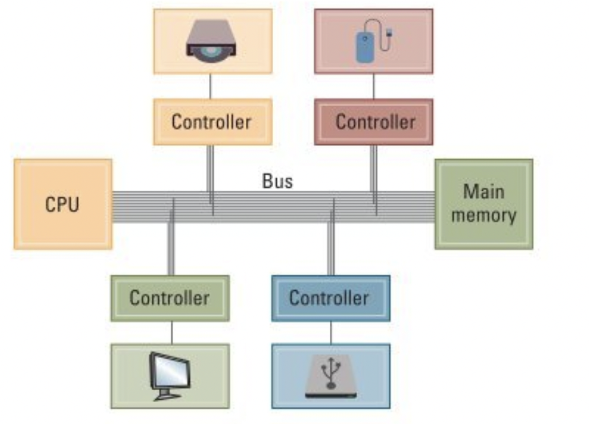

Peripherals, through the use of controllers can access main memory directly when CPU is not using the bus (a.k.a: Direct Memory Access).
This is a performace boost, an example of which would be the CPU instructing a controller to read from a section of the disk
and put it into main memory while the CPU can at the same time execute other tasks.

Exchange of data between devices is rarely a one way operation. For example, a computer can send data to a printer faster than the printer
can print it. In such cases we use the concept of **handshaking** in which the devices send information back and forth about
their respective states. This is often done using **status words** which the peripheral generates and the controller relays
to the CPU.

There are two types of communications:

- Parallel: Such as in printers where multiple wires allow for higher capacity and concurrent data transfers
- Serial: Messages are sent one after the other over a single wire

Data transfers are measured in **bits per seconds (bps)**. Kbps (Kilo-bps is 1000 bps), Mbps (Mega-bps is a million bps),
Gbps (Giga-bps is a billion bps )

## Operating Systems

Operating systems are softwares that manage the overall activities of a computer such as storing/retrieving files, request
the execution of programs and provide and environment for programs to execute.

Operating systems evolved since their inception in teh 1940s. Computers were large machines and programs required physical
components to be setup in specific manners to execute. In such a paradigm OS started off as ways to simlify the setup between
two program executions. Job were handed to computer operators and executed in a first-in first-out manner.

Jobs were accompanied by sets of instruction on how to run, called Job Control Language (JCL). This paradigm was called batch
processing and the users had no interaction with the program once it was set off. This gap lead to the development of interactive
processing where a terminal was made available to users.

To be successfull, interactive processing needed to be responsive to the users. You couldnt wait untill a program was done
processing before taking in additional commands from the user. Forcing the computer to execute tasks under a timeline is
called real-time processing.

As computers were expensive in the 1970s they had to be shared by multiple users. For real-time processing to work well in
this situation you had to implement **time-sharing**. This was done using **multiprograming** in which time was divided
into intervals in which individual tasks were executed. If a task was not completed within that interval the computer will
set it aside and execute another task. When the previous task gets picked up again it resumes where it left off.

Multiprograming is similar but refers to a single users running multiple tasks as opposed to multiple users each running
a task.

As operating systems evolved they are now capable of assigning different tasks to different processors on the same machine
or share time between task within a single processor.

- Load balancing among the processor
- Scaling: breaking tasks into sub-tasks compatible with the number of processors availble.

### Operating System Architecture

The internal part of the OS is called the kernel. Some of the components of a kernel are:

- The file manager: responsible for maintaining records of all file in storage as well as which users can access them.
- Device drivers: software responsible for communicating with controllers (USB, mass storage disks ..).
- Memory manager: responsible for the use and allocation of main memory.
  - They can rotate programs in/out between main memory and mass storage in a process called **paging** which creates what
  is called **virtual memory**.
- Scheduler & Dispatcher: The first determines the order of execution, the second allocates time to these activities.

Starting a computer that is powered down is know as **bootstraping**. Each time it is turned on, the OS is transfered
into main memory from mass storage.

Main memory is wiped clean when a machine is powered down. So how does CPU know where to look for the OS? A special part
of main memory is created using non-volatile memorty cells that are read only. These cells contain the initial instruction
that the CPU finds and executes in stratup. These instruction start the process of loading the OS to main memoryt called
**boot loader**.

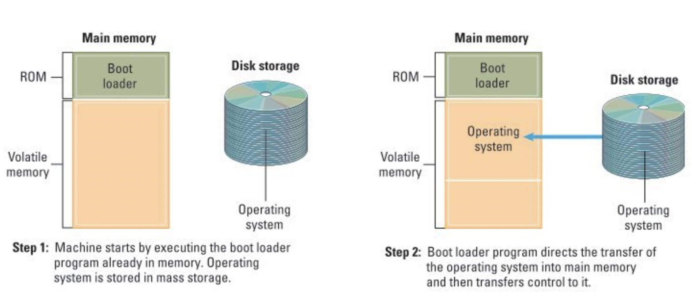

Placing OS in mass storage and not inside a large block of ROM memory cells serves the dual purpose of allowing the OS to
be continuously updated as well as use memory more efficiently.

### The concept of a Process

A program is a static set of instrution stored on memory while a process is the program being executed by the OS. The curent
status of a task is called **process state**.

Handling the execution of multiple tasks/process that are concurently competing for ressources is the responsability of the
scheduler and dispatcher.

The scheduler keeps a log of the tasks to be executed in as "pool", adds tasks to that pool and removes them once they're
completed. This pool of tasks to execute is called the "process table". Each time a process is requested for execution the
scheduler creates an entry in the process table for it that contains metadata such as memory area assigned to it, its
priority and wether it is ready or waiting.

A process is in waiting state if its execution is blocked untill an external event occurs such as mass storage data transfer,
the pressing of a key, the arrival of a message from another process. Ready state is the opposite and means it can be executed
immediatly.

The dispatcher assigns time slices for the processes maintained by the scheduler. In each time slice the CPU's attention
is turned to that process and executes it within that time. This is called context switching. Each time the dispatcher assigns
a time slice to a process it start a timer circuit that will send an interrupt signal to the process once the timer is done.

At the receipt of an interrupt signal, the CPU executes an interrupt handler which saves the current state of the process
and hands the control back to the dispatcher which will choose the next task based on which has the highest priority.

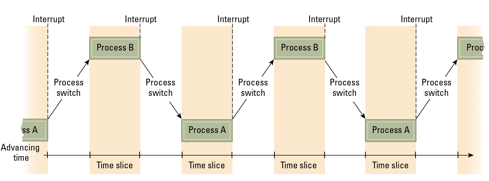

The context switching process depends on the ability of the CPU to reload the environment and recreate the process state.
This includes reloading the registers with the appropriate values. Most CPUs have machine language instructions for these
specific tasks.

### Handling competing processes

The OS must keep track if a ressource has been allocated to a process in order to prevent two processes accessing the same
ressource at the same time.

One approach is to use clear/set flags (0/1). If a process requests access to the printer for example, the OS will check
the flag and if it is set (currently in use by another process) it will make the new requesting process wait before being
able to execute.

There is a problem with this approach because the value of this flag needs to be retrieved from memory and changed. If a process
requests the value of the flag but is interupted (end of time slice) before it could modify the value, another process may
swoop in and change the value of this flag and use that ressource. The first process, upon resuming, will then also start using
the printer because the last thing it "saw" was a printer available for use. You find yourself in a situation where two processes
are using the same ressource.

A solution is to insist that testing and setting the flag be done without interupt. This is accomplished using the interrupt
disable and interrupt enable instructions. The CPU will not respond to interrupt signals or resume responding to them with
these commands. In a case like the above the interrupt disable is first executed before testing the flag to ensure that the
flag setting (if needed) is done without the risk of running out of the current time slice. The interrupt enable is executed
after the flag testing and (possible) setting is completed.

Another approach  is **test-and-set** in which the both steps are executed within the same machine instruction and thus no
possibility of interrupting  before the setting the flag is done.

A properly implemented flag is called a **semaphore** and it enforces **mutual exclusion** in which a sequence of instructions
called the **critical region** can only be executed by one process at a time.

Another case of a bug with competing processes is a **deadlock** where two processes are waiting for a ressource to be
liberated by another.

An example is of two processes, one with access to the DVD drive but waiting for the printer while the other with
access to the printer and waiting for the DVD driver. Another example would be in the case of processes that can create sub-processes
(forking) to complete subtasks. If the process table is full and cannot accomodate additional tasks then the tasks that
require sub-tasks to complete before completing themselves are blocked.

Three conditions need to be present for a deadlock to arise:

- Competition for non-shareable ressrources
- Ressources are requested on a partial basis (upon receiving some ressources, a
  process will come back later for more)
- Once a ressource has been allocated it cannot be forcefully retrieved

There are techniques to avoid this situation:

- Kill processes that are causing the deadlock
- Require processes to requests all the ressource at once.
- Make shared ressources shareable
  - In the example of a printer, allow processes to send data to a driver that
  stores data temporarly. Processes think they have access to a printer but in
  reality they're saving data to mass storage and the execution will happen when
  the printer is available. This is called **spooling**

Some other techniques would be granting multiple processes read access to a file
but only once process has write access. Another would be to break the file into
region and multiple processes have write access to specific regions.

## Databases

- databases are collections of data that have links between them which allows them
  to be read in a variety of perspectives
- siloed data = duplication and integrity issues
- schemas are descriptions of the strucure of databases, sub-schemas relate to specific
  portions of databases
  - they allow for granular access control to data within databases
- Operations on databases are done using DBMS (database management systems)
- two major models of databases
  - relational --> collection of columns and rows
  - object oriented --> data represented as collection of key value pairs

### The relational model

Data in relational databases can be though of as rectabgular tables called **relations**,
each row is called a **tuple** and columns are called **attributes**