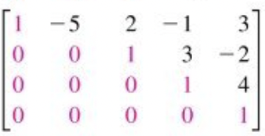
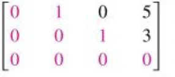

# Precalculus

- [Precalculus](#precalculus)
  - [Exponential \& Logarithmic Functions](#exponential--logarithmic-functions)
    - [Exponential Functions](#exponential-functions)
      - [Learning Outcomes](#learning-outcomes)
      - [Definition: Exponential Expression](#definition-exponential-expression)
      - [Definition: The Exponential Constant](#definition-the-exponential-constant)
      - [Definition: Operations on Exponentials](#definition-operations-on-exponentials)
      - [Definition: Properties of Exponential Function](#definition-properties-of-exponential-function)
    - [Logarithmic Functions](#logarithmic-functions)
      - [Learning Outcomes](#learning-outcomes-1)
      - [Definition: Logarithmic Functions](#definition-logarithmic-functions)
      - [Skill: Convert exponentials to logs (\& vice versa)](#skill-convert-exponentials-to-logs--vice-versa)
      - [Skill: Changing of bases](#skill-changing-of-bases)
      - [Definition: Operations on **logarithms**](#definition-operations-on-logarithms)
      - [Skill: Solving exponential and log equations](#skill-solving-exponential-and-log-equations)
  - [Vector \& Matrices](#vector--matrices)
    - [What are vectors?](#what-are-vectors)
    - [What are vector spaces?](#what-are-vector-spaces)
      - [Properties of vector spaces](#properties-of-vector-spaces)
    - [Unit Vectors](#unit-vectors)
    - [Cartesian Vectors](#cartesian-vectors)
    - [Vector Multiplication](#vector-multiplication)
      - [Scalar/Dot Product](#scalardot-product)
      - [Cross Product](#cross-product)
    - [Transformations: Scaling, Rotations \& Translations](#transformations-scaling-rotations--translations)
      - [Rotating a vector](#rotating-a-vector)
      - [2D Translations](#2d-translations)
      - [2D Scaling](#2d-scaling)
      - [Referencing arbitraty points in transformations](#referencing-arbitraty-points-in-transformations)
      - [2D Reflections](#2d-reflections)
    - [Matrix addition and mutliplication](#matrix-addition-and-mutliplication)
    - [Elementary Matric Row Operations](#elementary-matric-row-operations)
    - [Row Echelon Form](#row-echelon-form)
    - [The inverse of a matrix](#the-inverse-of-a-matrix)
    - [Minors and Cofactors](#minors-and-cofactors)
  - [Gradients \& Differentiation](#gradients--differentiation)
    - [Learning Outcomes](#learning-outcomes-2)
    - [Definition: Gradient of a function](#definition-gradient-of-a-function)
    - [Definition: The gradient expression of common functions](#definition-the-gradient-expression-of-common-functions)
    - [Definition: Operations on gradients](#definition-operations-on-gradients)
    - [Definition: Second derivative](#definition-second-derivative)
    - [Definition: Maximums \& Minimums](#definition-maximums--minimums)
    - [Defintion: The product rule](#defintion-the-product-rule)
    - [Defintion: The quotient rule](#defintion-the-quotient-rule)
    - [Defintion: The chain rule](#defintion-the-chain-rule)
  - [Statistics](#statistics)
    - [Arithmetic Mean](#arithmetic-mean)
    - [Varianace](#varianace)
  - [Probalibilities](#probalibilities)
    - [Complimentary events](#complimentary-events)
    - [Measuring probabiity](#measuring-probabiity)
    - [Indpendent events](#indpendent-events)
    - [Union of events in the sample space](#union-of-events-in-the-sample-space)
    - [Counting principles](#counting-principles)
    - [Permutations](#permutations)
    - [Combinations](#combinations)

## Exponential & Logarithmic Functions

### Exponential Functions

#### Learning Outcomes

By the end of this section you should be able to:

- Describe the form of an exponential function & list their properties
- Simplify exponential expressions and demonstrate your steps
- Solve equations with exponential terms

#### Definition: Exponential Expression

Exponential function have the form **$a^x$** where a is a constant called the base
and x is an exponent called the index.

An example would be the graph of $2^x$ [link to wolframe alpha](https://www.wolframalpha.com/input?i2d=true&i=Power%5B2%2Cx%5D):

We can think though the logic of plotting these points:

$2^-2=1/2^2=0.25$

$2^-1=1/2^1=0.5$

$2^0=1$

$2^-1=2^1=2$

$2^2=4$

And so on so forth.

#### Definition: The Exponential Constant

A common exponential expression is $e^x$ where $e \approxeq2.71828....$. It's
used in the modeling of various natural phenomema such as the population growth
and the spread of bacteria.

#### Definition: Operations on Exponentials

The following properties can be used to caculate expressions having exponential terms.

$$
a^x*a^y=a^{x+y}\\
\frac{a^x}{a^y}=a^{x-y}\\
a^0=1\\
(a^x)^y=a^{x*y}
$$

#### Definition: Properties of Exponential Function

- It is never negative
- If $x=0$ then $x^0=1$
- $\lim_{x \to \infty}a^x= \infty$ (as x approachs infinity so does a $a^x$)

### Logarithmic Functions

#### Learning Outcomes

- Define the log function and illustrate is graphically
- Explain the term base of a logarithm
- Calculate the logarithm of a number to any base
- State the laws of logarithms and use them to simplify expressions

#### Definition: Logarithmic Functions

Logarithm can be though of as the inverse of an exponential. In essense the logarithm
of a number is the index/exponent $x$ that yields the number when we raise the base
with it.

If $y = a^x$ then $\log_a{y}=x$.

e.g: $125=5^3$ and $\log_5{125}=3$

Saying "logarithm to the base a of y" is x is the equivalent to "y is a to the
power x"

#### Skill: Convert exponentials to logs (& vice versa)

#### Skill: Changing of bases

Log expressions can be rewritten into fraction of logs in another base using the
two terms in the expression

Using base 10:

$\log_a{X} = \frac{log_{10}{X}}{log_{10}{a}}$

Using arbitrary bases:

$\log_a{X} = \frac{log_{b}{X}}{log_{b}{a}}$

Using natural logs:

$\log_a{X} = \frac{ln_{X}}{ln_{a}}$

#### Definition: Operations on **logarithms**

$\log{A} +\log{B} = log{(A*B)}$

$\log{A} -\log{B} = log{\frac{A}{B}}$

$n*log{A}=log{A^n}$

#### Skill: Solving exponential and log equations

## Vector & Matrices

### What are vectors?

- A vector is a mathematical object used to describe quantities that have a numerical
  values and a specific direction in space.
  - They're central in modeling physica quantities such as velocity, acceleration
  & displacement
- To distinguish them from scalar values, which only have numerical values, they
  are denoted using arrow notation asd
  - A scalar $v$ is not the same as $\overrightarrow{V}$ which is a vector
- Vectors are represented by their components, numerical values that indicate how
  much it extends over an axis in the coordinate system.
  - In two dimensional space we can have $\overrightarrow{V}=(x,y)$
  - In three dimensional space we can have $\overrightarrow{W}=(x,y,z)$
- Vectors can be visualized as lines with the an initial and end points (a.k.a:
  tails and heads).
  - The length of the line segment is the magnitude of the vector.

### What are vector spaces?

- A vector space is a mathematical structure that defines a set of vectors and the
  operations that can be exectuted on them.
- Vector spaces are denoted with symbol $V=\mathbb{R}^n$
- They can have any number of dimensions and vectors can be real or complex numbers

#### Properties of vector spaces

Certain properties must be met to qualify as a vector space:

- Closure under addition:
  - if $\overrightarrow{V}$ & $\overrightarrow{W}$ are in $\mathbb{R}^n$ then
 $\overrightarrow{V} + \overrightarrow{W}$ is also in $\mathbb{R}^n$
- Closure under scalar multiplication:
  - For any scalar $x$ we $x * \overrightarrow{V}$ in in $\mathbb{R}^n$
- Addition Associativity:
  - $\overrightarrow{V}+(\overrightarrow{W} +\overrightarrow{Z})$ = ($\overrightarrow{V}+\overrightarrow{W})+\overrightarrow{Z}$
- Addition Commutativity:
  - $\overrightarrow{V}+\overrightarrow{W}=\overrightarrow{W} +\overrightarrow{V}$
- Identity Element: For $\overrightarrow{O}$, the zero vector
  - $\overrightarrow{V}+\overrightarrow{O}=\overrightarrow{V}$
- Additive Inverse: For any $\overrightarrow{V}$ there exist $\overrightarrow{W}$
  such that $\overrightarrow{V}+\overrightarrow{W}=\overrightarrow{O}$
- Scalar Multiplicative Distributivity:
  - $a*(\overrightarrow{V}+\overrightarrow{W})=a*\overrightarrow{V}+a*\overrightarrow{W}$
- Vector Multiplicative Distributivity:
  - $(a+b)*\overrightarrow{V}=a*\overrightarrow{V}+b*\overrightarrow{V}$
- Scalar Multiplicative Associativity:
  - $(a*b)*\overrightarrow{V}=a*(b*\overrightarrow{V})$

### Unit Vectors

- Unit vectors have a magnitude of 1. They are useful because they simpify computation.

$i = \begin{bmatrix}1\\0\\0\\\end{bmatrix} \quad and  \quad \lVert i \rVert =1$

- The process of converting a vector into unit form is called **normalizing**

$r_u=\frac{1}{\lVert r \rVert}*\sqrt{x^2+y^2+z^2}$

### Cartesian Vectors

We define the cartesian unit vectors as:

$i=\begin{bmatrix}1\\0\\0\\\end{bmatrix},j=\begin{bmatrix}0\\1\\0\\\end{bmatrix},k=\begin{bmatrix}0\\0\\1\\\end{bmatrix}$

Any vector can be expressed as a combination of these vectors.

$r=ai+bj+ck$

Which is equivalent to writing

$r=\begin{bmatrix}a\\b\\c\end{bmatrix}$

This means that it magnitude is:

${\lVert r \rVert}=\sqrt{a^2+b^2+c^2}$

And that any combination $a+b$ can be written as:

$r \pm u = (a\pm d)i + (b\pm e)j + (c\pm e)k$

### Vector Multiplication

Vector multiplication can be done in two ways. One leads to a scalar result and
the other to a new vectors

#### Scalar/Dot Product

$s \cdot r = \lVert r \rVert \cdot \lVert s \rVert * \cos\beta$

#### Cross Product

Two vectors a & b can be multiplied together to produce a third vector t
$$
a*b=c
$$

$$
\lVert c \rVert = \lVert a \rVert * \lVert b \rVert * \sin\beta
$$

If we have

$$
a=a_1i+a_2j+a_3k\\
b = b_1j+b_2j+b_3k
$$
$$
a=\begin{bmatrix}a_1\\a_2\\a_3\end{bmatrix},
b=\begin{bmatrix}b_1\\b_2\\b_3\end{bmatrix}
$$
Then the cross product is:
$$
a*b=\begin{bmatrix}a_2&a_3\\b_2&b_3\end{bmatrix}*i-\begin{bmatrix}a_1&a_3\\b_1&b_3\end{bmatrix}*j+\begin{bmatrix}a_1&a_2\\b_1&b_2\end{bmatrix}*k
$$

$$
a*b=(a_2b_3-b_2a_3)*i-(a_1b_3-b_1a_3)*j+(a_1b_2-b_1a_2)*k
$$

### Transformations: Scaling, Rotations & Translations

#### Rotating a vector

Rotating a vector procuces a new vector that has the same origin/tail and magnitude
but differs in direction.

If $\alpha$ is the angle between the two vector $\overrightarrow{OP}$
& $\overrightarrow{OP_R}$ then:

$$
\overrightarrow{OP_R} = \begin{bmatrix}x\cos\alpha+y\sin\alpha\\-x\sin\alpha+y\cos\alpha\end{bmatrix}
$$

#### 2D Translations

$$
x^{\prime}=x+t_x  \\
y^{\prime}=y+t_y
$$

$$
b=\begin{bmatrix}x^{\prime}\\y^{\prime}\\1\end{bmatrix}=
\begin{bmatrix}1&0&t_x\\0&1&t_y\\0&0&1\end{bmatrix}\cdot
\begin{bmatrix}x\\y\\1\end{bmatrix}
$$

#### 2D Scaling

$$
x^{\prime}=s_xx  \\
y^{\prime}=s_yy
$$

$$
b=\begin{bmatrix}x^{\prime}\\y^{\prime}\\1\end{bmatrix}=
\begin{bmatrix}s_x&0&0\\0&s_y&0\\0&0&1\end{bmatrix}\cdot
\begin{bmatrix}x\\y\\1\end{bmatrix}
$$

#### Referencing arbitraty points in transformations

Tranformations are relative to the origin (0,0), to reference other points (p_x,p_y)
we use the below:

$$
x^{\prime}=s_x(x-p_x) + p_x  \\
y^{\prime}=s_y(x-p_y) + p_y
$$

$$
b=\begin{bmatrix}x^{\prime}\\y^{\prime}\\1\end{bmatrix}=
\begin{bmatrix}s_x&0&p_x(1-s_x)\\0&s_y&p_y(1-s_y)\\0&0&1\end{bmatrix}\cdot
\begin{bmatrix}x\\y\\1\end{bmatrix}
$$

#### 2D Reflections

Along the x axis:

$$
b=\begin{bmatrix}x^{\prime}\\y^{\prime}\\1\end{bmatrix}=
\begin{bmatrix}-1&0&0\\0&1&0\\0&0&1\end{bmatrix}\cdot
\begin{bmatrix}x\\y\\1\end{bmatrix}
$$

Along the y axis:

$$
b=\begin{bmatrix}x^{\prime}\\y^{\prime}\\1\end{bmatrix}=
\begin{bmatrix}1&0&0\\0&-1&0\\0&0&1\end{bmatrix}\cdot
\begin{bmatrix}x\\y\\1\end{bmatrix}
$$

### Matrix addition and mutliplication

- $A+B=B+A$
- $A+(B+C)=(A+B)+C$
- $(cd)A=c(dA)$
- $c(A+B)=cA+cB$
- $(c+D)A=cA+dA$

### Elementary Matric Row Operations

A system of equations such as:

$$
x_1=a_1+b_1+c_2=d_1\\
x_2=a_2+b_2+c_2=d_2\\
x_3=a_3+b_3+c_3=d_3\\
$$

can be written in matrix form as:

$$
X=\begin{bmatrix}a_1&b_1&c_2\vdots&d_1\\a_1&b_1&c_2\vdots&d_2\\a_1&b_1&c_2\vdots&d_3\end{bmatrix}\cdot
$$

we can do the following operation while preseving equality:

- Interchange two rows $R_1 \leftrightarrow R_2$
- Multipy a row by non-zero constants $cR_1$
- Add a multiple of a row to another $R_1+cR_2$

### Row Echelon Form

Row echelon form allow us to solve systems of equations in matrix form, they have
the following properties:

- Any row of all zeros is at the bottom of the matrix
- For all non-zero rows the first/leading element is a 1
- Two successive rows, the leading 1 in the higher row is farther to the left than
  the bottom row

Note: If every column that has a leading 1 has nothing but zeros above and below
it is called a reduced row echelon form.

### The inverse of a matrix

$$
A^{-1}A=I_n=AA^{-1}
$$

The inverse of a matrice can be found with the Gauss-Jordan elimination (finding
the reduced row echelon matrice) or (in the case of 2x2) using the determinant.

If a 2x2 matrice has a non-zero determinant it can be inverted using the below formula.

$$
A=\begin{bmatrix}a&b\\c&d\end{bmatrix}
$$
$$
\det{A}=ad-bc
$$
$$
A^{-1}=\frac{1}{det{A}}*\begin{bmatrix}d&-b\\-c&a\end{bmatrix}
$$

### Minors and Cofactors 

In square matrices larger than 2x2 it is possible to find the determinant using
more complex formulas. We'll need to compute the determinants of smaller matrices
that make up the larger matrice.

If A is a square matrice then the minor $M_{ij}$ of the entry $a_{ij}$ is the determinant
of the matrice C obtained by deleting the ith row and jth column. The cofactor $C_{ij}$
is $(-1)^{i+j}M_{ij}$

The determinant of a n*n matrix is the sum of any entries of a row (or column) multiplied
by their respective cofactors.

$$
\det{A}=a_{11}M_{11}+a_{12}M_{12}+...a_{1n}M_{1n}+
$$

## Gradients & Differentiation

### Learning Outcomes

- Find the expression of the gradient of a function for all points
  - Explain the relation between trigonometric functions and their gradients
  - Demonsrate the particular case of an exponetial functions gradients
- Compute the gradient of a function at a given point
- Do basic operations on gradient of two or more function
- Define & find the second derivative
- Find maximums and minimums of functions
  - Define stationary points and compute them algebraicly
  - Use the second derivative test to identify maximums and minimums
  - Contrast local & global maximums and minimums
- Use the product, quotient & chain rules to find derivatives of more
  complexes funtions

### Definition: Gradient of a function

The gradient of a function is the tangent of the slope of a function at a given point.
It can be approximated by looking at the slope of a line between two points along
the curve of the function as the distance between the two points tends to zero.

We denote the gradient of $f$ as $f'$

f'(x) = $\lim_{h \to 0}\frac{f(x+h)-f(x)}{h}$

Graphically it looks like the following [graph](https://www.wolframalpha.com/input?i2d=true&i=tangent+line+%7C+to+%7C+y+%3D+Power%5Bx%2C2%5D+at+%7C+x+%3D+3)

We can think of two points along the curve of $f(x)=x^2$, where $x_1=2$ & $x_2=h$.
If $h=1$ then $x_2=3$. Thus $f(2)=2^2=4$ & $f(3)=3^2=9$.

The slope between $f(2)$ & $f(3)$ is $\frac{f(3)-f(2)}{3-2}=\frac{9-4}{3-2}=5$ as can be see in this [graph](https://www.wolframalpha.com/input?i=plot+5x-6%2C+x%5E2+%2C+x%3D1.9+to+3.1)

However as the distance between the two points goes 0 (or close to 0) the slope
of that curve converges towards the true gradient which is 4 [graph](https://www.wolframalpha.com/input?i=plot+x%5E2%2C+4x-4%2Cx%3D1to+3)

Note that the line in the above graph only intersects the slope of the function
at $x=2$

### Definition: The gradient expression of common functions

We can find the derivatives of functions from their form. A few common
expressions and their derivatives can be found here:
|             |                |                 |
| ----------- | -------------- | --------------- |
| $f(x)$      | f'(x)          | Notes           |
| $constant$  | $0$            |                 |
| $x$         | $1$            |                 |
| $x^2$       | $2*x$          |                 |
| $x^n$       | $n*x^{n-1}$    |                 |
| $e^x$       | $e^x$          |                 |
| $e^{kx}$    | $k*e^{kx}$     | k is a constant |
| $sin(x)$    | $cos(x)$       |                 |
| $cos(x)$    | $-sin(x)$      |                 |
| $sin(k*x)$  | $k*cos(kx)$    | k is a constant |
| $cos(k*x)$  | $-k*sin(k*x)$  | k is a constant |
| $ln(k*x)$   | $\frac{1}{x}$  | k is a constant |

### Definition: Operations on gradients

Basic operation such as additions, substraction and multiplication follow the
below rules:

- If $y=f(x)+g(x)$ then $y'=f'(x)+g'(x)$
- If $y=f(x)-g(x)$ then $y'=f'(x)-g'(x)$
- If $y=k*f(x)$ where k is a constant, then $y'=k*f'(x)$

### Definition: Second derivative

The rate of change of the derivatice itself is called the second derivative, it is
denoted as $y''$. Calculating it follows the same rules as for the first derivative.

$$
y''=\frac{d^2y}{dx^2}
$$

When a function is upward sloping its first derivative is positive, however, it
increases at higher rates if the second deriative is also positive. On the other
hand if the seocnd derivative is negative then the rate of increase is slowing down.
The same is true in reverse.

In the case of the below function ($y=x^2$), up to $x=0$ the slope is negative
but the second derivative is postive. That is why you see a "slowing down" of
the descent but beyong $x=0$ you see an acceleration of the increase (because both
the first and second derivatives are positive).

$$
y=x^2 \\
y'=2*x\\
y''=2
$$

### Definition: Maximums & Minimums

On a graph, points that have gradients equale to zero are called **stationary points**
because the curve of the graph at that point neither increases or decreases. Such
is the case for points A,B,C & D.

However, a gradient of zero alone doesn't let us know if the given point is a maximum
or a minimum. Taking point A for example, if we approach it from the left, points
on the graph on that side have a positive gradient. If we move away from it to the
right those points long the graph would have a negative gradient as the slope is
downwards facing.

We can find gradient points algebraicly by setting the function's expressions  equal
to zero and solving for $y'=0$.

In general, maximums and minimums have gradients of opposing signs on each side of
the max/min point while points f inflexion have gradients that stay of the same sign.

You can use second derivatives to test wether a stationary point is a max/min or neither.

- if $y''>0$ then it is a minimum (the rate of change of the gradient
  is positive beyong that points)
- if $y''<0$ then it is a max (same reasoning as previously but in reverse)
- if $y''=0$ we can't be sure and we should compute the first derivative on both
  sides of the stationary point to be sure.

### Defintion: The product rule

There are additional rules that can be used to extend the types of functions
that we can differentiate. If $y(x)=a(x)*b(x)$ we can use the product rule

$$
\frac{dy}{dx}=\frac{da}{dx}*b+\frac{db}{dx}*a
$$

TODO: EXAMPLES

### Defintion: The quotient rule

If $y(x)=\frac{a(x)}{b(x)}$ we can use the quotient rule

$$
\frac{dy}{dx}=\frac{b*\frac{da}{dx}-a*\frac{db}{dx}}{b^2}
$$

TODO: EXAMPLES

### Defintion: The chain rule

If $y=y(x)$ & $x=x(t)$ we can use the chain rule

$$
\frac{dy}{dt}=\frac{dy}{dx}*\frac{dx}{dt}
$$

TODO: EXAMPLES

## Statistics

### Arithmetic Mean

$$
mean = \bar{x}= \Sigma_{i=0}^{n}\frac{x_i}{n}
$$

### Varianace

$$
variance = \sigma^2 = \frac{\Sigma_{i=0}^{n}(x_i - \bar{x})^2}{n}
$$

$$
standard deviation = \sigma = \sqrt{\frac{\Sigma_{i=0}^{n}(x_i - \bar{x})^2}{n}}
$$

## Probalibilities

### Complimentary events

If two events are mutually excelusive and if one doesn't happend then the other
must, e.g: a lightbulb is either on or off

$$
P(A)=1-P(B)
$$

### Measuring probabiity

$$
P(event)= \frac{number of ways event can occur}{total number of possibilities}
$$

### Indpendent events

If an event has no impact on the probality of the occurance of the next event, e.g:
a roll of the dice. This is in contrast with dependent events (pulling a card for
a deck without replacing it)

If two events are independent:
$$
P(A\ and\ B) = P(A)*P(B)
$$

### Union of events in the sample space

Unions can be thought of as **OR** statements. Imagine we ask, what are the chances
of getting a card that is a heart OR a face. The probability of such an event is

$$
P(heart\ \cup\ face) = P(heart) + P(face) - P(heart\ \cap\ face)
$$

$P(heart\ \cap\ face)$ means intersection, such as a king of heart. It can thought
of as a heart AND a face.

### Counting principles

If two events $E_1$ & $E_2$ can occure respectivly in $m_1$ and $m_2$ ways then
the number of ways the two events can occure is $E_1*E_2$

### Permutations

Permutations are used to count the number of ways $n$ elements can be arragned in
order. The first position can be any of the elemnents, the second any of the **remaining**
elements and so forth:

$$
P_n = n\cdot(n-1)\cdot(n-2)\cdot...\cdot2\cdot1
$$

If we take only a subset of element from a larger number of elements the number
of permutations is:
$$
_{n}P_{r}=\frac{n!}{(n-r)!}
$$

### Combinations

Combinations are similar to permutations but the order is not important
$$
_{n}C_{r}=\frac{n!}{(n-r)!*r!}
$$
